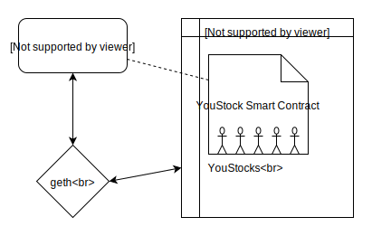

# YouStock

YouStock is a decentralized application built on the Aura blockchain network for creating and trading "people stocks". These are tokens that anyone can create and trade that are meant to represent the individual who creates them. See https://youstock.io for more information.

The architecture of YouStock can be visualized in the diagram below.

The YouStock client uses geth to communicate with the Aura blockchain and interact with the YouStock Smart Contract.

## Precompiled Binaries

Head over to the [releases](https://github.com/YouStock/beta/releases) and get the latest version for your system.

## Running from source

`git clone https://github.com/YouStock/beta.git`

`cd beta`

`npm install`

Download a geth binary for your system from (https://geth.ethereum.org/downloads/) and move it to `<project_folder>/src/assets/exe/` (you may need to create the `exe` folder first)

`npm run srv`

Leave the first shell/terminal running and open another one `npm run dev`

The first shell runs the web server to host the ui.  The second shell runs electron which spawns and communicates with geth.

## Code scaffolding

Run `ng generate component component-name` to generate a new component. You can also use `ng generate directive|pipe|service|class|guard|interface|enum|module`.

## Build

Run `ng build` to build the project. The build artifacts will be stored in the `dist/` directory. Use the `-prod` flag for a production build.

## Running unit tests (under construction)

Run `ng test` to execute the unit tests via [Karma](https://karma-runner.github.io).

## Running end-to-end tests (under construction)

Run `ng e2e` to execute the end-to-end tests via [Protractor](http://www.protractortest.org/).

## Further help

To get more help on the Angular CLI use `ng help` or go check out the [Angular CLI README](https://github.com/angular/angular-cli/blob/master/README.md).
